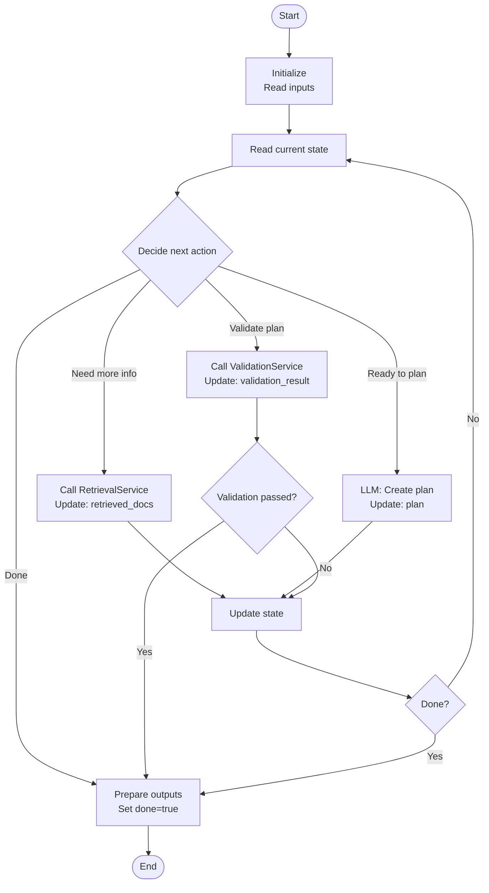
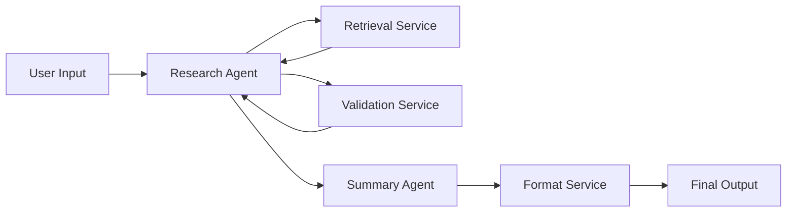

# Agent Architecture Design Workflow — Complete Reference

**ID:** architecture
**Description:** Transform your LLM call inventory into a clean agent architecture with clear boundaries, control loops, and handoff contracts

---

## How to Use This Workflow

**For participants:** Reference this file with `@` in Claude Code and say "Let's work through the architecture workflow." Claude will guide you through each step.

**For Claude:** When a participant starts this workflow:
1. Check `docs/reports/workflow_progress.md` — if this workflow shows "in progress", tell the participant which step they completed last and resume from there
2. Begin with Step 1 and follow each step prompt in order
3. Complete one step fully before moving to the next
4. Where a step shows "Confirm before continuing" — ask that question and wait for a response before proceeding
5. Save outputs to the file paths specified in each step
6. After each step confirm, update `docs/reports/workflow_progress.md` — set status to "in progress" and record the last step completed
7. When you reach the final step, update `docs/reports/workflow_progress.md` to "complete", let the participant know the workflow is complete, and remind them to update `docs/reports/session_log.md` and `docs/reports/decisions.md`

- Keep tone collaborative; explain why each decision matters for confident architecture design
- Use Socratic questioning — don't prescribe architectural patterns or system boundaries
- Engage as a thought partner, present one thought at a time
- Reads from: `docs/context_management_design.md`, `docs/problem_definition.md`, `docs/implementation_design.md`

---

## Steps

### Step 1: Load context management reality check and confirm if implementation state or quality risk understanding has changed
**Goal:** Load context management reality check and confirm if implementation state or quality risk understanding has changed


## Conversation Flow

### 1. Present Previous Reality Check

Share what you loaded from their context management workflow:
- "From your context management workflow, here's what you identified as your implementation reality: [summarize the implementation_reality_check section]"

### 2. Check for Changes

Simply ask:
- "Has anything changed since then? Any new learnings about your implementation or quality risk?"
- "Any updates to your platform, progress, or understanding?"

### 3. Document Updates (if any)

- **If changes:** Document what's new or different
- **If no changes:** Confirm the previous reality check still applies

### 4. Transition

- "Great, we'll use this as our foundation for architecture design"

**Deliver:** Save to `docs/specs/architecture_spec.md` with section:
- implementation_update (concise baseline understanding of current implementation, quality risk, and goals)

**User Context:**
- Provides: Their updated reflections on implementation progress, quality risk nuances, and platform constraints
- Receives: A documented foundation that ties architecture work to their quality risk and current reality

**Confirm before continuing:** "Does this capture your current quality risk and implementation state accurately?"

---

### Step 2: Group LLM calls into context domains using field matrix analysis, label clusters by reasoning focus, distinguish agent candidates from shared services
**Goal:** Group LLM calls into context domains using field matrix analysis, label clusters by reasoning focus, distinguish agent candidates from shared services


## Clustering Process

### 1. Create the Matrix

Build a table with LLM calls on left and context fields across the top:

```
| LLM Call | Field A | Field B | Field C | Field D | Field E |
|----------|---------|---------|---------|---------|---------|
| Call 1   |    ✓    |    ✓    |         |    ✓    |         |
| Call 2   |    ✓    |    ✓    |         |         |         |
| Call 3   |         |         |    ✓    |    ✓    |    ✓    |
```

Use their actual call names and field names from context_management_design.md.

### 2. Identify Clusters

Look for patterns:
- If two calls share ≥60-70% of their input fields → likely same cluster
- If a call's output is always directly used as input to just one other call → likely same cluster
- If calls reason about the same "object" (ticket, question, plan, etc.) → likely same cluster

**Conversation:**
- "I see Call 1 and Call 2 both use [fields X, Y, Z] — they share most of their context"
- "It looks like Call 3's output feeds directly into Call 4"

### 3. Label Each Cluster

For each cluster, ask:
- "What is this cluster really doing? In plain language, what is it reasoning about?"
- "What's the core task or problem this group of calls is solving?"

**Good labels:**
- "Ticket understanding + reply drafting"
- "Research question analysis + evidence synthesis"

### 4. Identify Shared Services

Calls that DON'T fit into clusters:
- Used by MANY clusters (generic retrieval, summarization, formatting)
- Single-purpose utility (extract entities, validate format, classify)
- No evolving state — same input always gives same output type

**Deliver:** Append to `docs/specs/architecture_spec.md` with sections:
- context_domain_clustering (llm_call_context_field_matrix, identified_clusters, shared_context_services, clustering_summary)

**User Context:**
- Provides: Their insight into how their LLM calls relate and which ones share fields or reasoning focus
- Receives: Visual clustering that lays groundwork for agent and service decisions

**Confirm before continuing:** "Do these clusters reflect how your LLM calls naturally group together?"

---

### Step 3: Classify each cluster as agent or service using the 3-question test, scope to max 2 agents
**Goal:** Classify each cluster as agent or service using the 3-question test, scope to max 2 agents


## The 3-Question Test

For each cluster from Step 2, apply this test:

### Question 1: Does this need evolving state across multiple steps?
- Does it update a plan, refine a draft, track progress, accumulate evidence?
- Or does it just do one thing and return a result?

### Question 2: Does it need to choose between multiple possible next actions?
- Does it sometimes retrieve more, sometimes ask user, sometimes call a tool, sometimes stop?
- Or does it always do the same sequence?

### Question 3: Is there a stable "object of concern" it reasons about over time?
- Does it reason about "this ticket", "this repo", "this research question"?
- Or is it stateless processing?

**Scoring:**
- YES to at least 2 of 3 → **make it an AGENT**
- NO to most questions → **it's a SERVICE**

## Scope Check — Max 2 Agents

If they have >2 agent candidates:
- "I see we've identified [N] potential agents"
- "For a class project, managing more than 2 agents gets complex quickly"
- "Which ones are most critical for testing your quality risk?"
- "Can we focus on the top 2 and treat the others as services for now?"

Provide suggestions for how they can reduce the responsibility of non-urgent "agents" so they behave more like services:
- e.g., "I see agent 3 has to plan the next five actions — what if we set it to select from pre-determined action menus for now?"

## Handle "No Agents" Outcome

If all clusters classify as services:
- "Based on the 3-question test, everything you have is a service — not an agent"
- "That's totally valid! Your implementation is service-based"
- "If this setup is solving your problem and testing your quality risk, there's no need to add complexity"

**If they want at least one agent:** "Let's brainstorm how we could add minimal agentic behavior motivated by your quality risk."

**Examples of minimal agent additions:**
```
Current: retrieve → summarize → format → return
Agent wrapper:
  - Decide if retrieved info sufficient (quality check)
  - If insufficient, retrieve more with refined query
  - Accumulate evidence across iterations
  - Decide when "good enough" for quality risk
```

**Deliver:** Append to `docs/specs/architecture_spec.md` with sections:
- agent_vs_service_classification (three_question_test_results, final_architecture_overview, agents, services, scope_check)

**User Context:**
- Provides: Their judgment on how each cluster behaves and which components truly need agentic control
- Receives: Clear architecture classification grounded in their quality risk priorities

**Confirm before continuing:** "Does this agent/service split feel manageable and aligned with your goals?"

---

### Step 4: Catch architectural issues (dependencies, ownership, handoffs) as a collaborative sanity check before detailed design
**Goal:** Catch architectural issues (dependencies, ownership, handoffs) as a collaborative sanity check before detailed design


## Validation Checks

Run through these checks systematically:

### Check 1: Circular Dependencies
- "If Agent A needs Agent B's output, and Agent B needs Agent A's output, we have a problem"
- If found: "Options: (1) Merge them, (2) Separate the dependency, (3) Rethink the flow"

### Check 2: Unclear Context Ownership
- "If two agents both claim to 'own' (update) the same field, which one is right?"
- Services shouldn't "own" fields (they're stateless), but agents can

### Check 3: Orphaned Context
- "I see [field X] is used by [Agent/Service A], but I don't see who's responsible for creating it"
- "Options: (1) Assign an agent/service to produce it, (2) Remove if not needed, (3) Comes from external input"

### Check 4: Missing Handoff Paths
- "[Agent/Service B] needs [field X], which [Agent/Service A] produces"
- "But I don't see a handoff path from A to B — how should this data pass?"

### Check 5: Agent/Service Misclassification
- Something labeled "service" that actually has agent characteristics
- Something labeled "agent" that's really just a utility (stateless transformation)

## Conversation Flow

1. Frame as sanity check: "This catches common issues early, before we've done a lot of detailed work"
2. For each check: Explain what you're checking; run the check; present issues and propose options
3. For each issue: Present 2-3 resolution options, explain trade-offs, document agreed resolution
4. After all checks: "We found [N] issues and agreed on resolutions. Does this architecture feel right now?"

**Deliver:** Append to `docs/specs/architecture_spec.md` with sections:
- architecture_validation (validation_checks, issues_and_resolutions, approved_architecture_snapshot)

**User Context:**
- Provides: Their clarifications on data ownership, dependencies, and how components interact
- Receives: Confidence that the architecture is sound before moving into detailed specs

**Confirm before continuing:** "Do these validation results address any lingering concerns?"

---

### Step 5: Design agent control loops with Mermaid flowcharts showing decision points, state transitions, and termination conditions
**Goal:** Design agent control loops with Mermaid flowcharts showing decision points, state transitions, and termination conditions


**Skip this step entirely if 0 agents (service-oriented architecture).**

## Core Task: Design Agent Control Loops

For each agent, create a Mermaid flowchart showing:
1. How it reads input/current state
2. How it decides next action
3. What tools/services it invokes
4. How it updates its state
5. When/how it terminates

## Conversation Flow

### For Each Agent:

#### Step 1: Understand the Agent's Reasoning Process
- "Walk me through how [Agent Name] operates"
- "What's the first thing it does when it starts?"
- "How does it decide what to do next?"
- "What are the different paths it might take?"
- "When does it know it's done?"

#### Step 2: Identify Decision Points
- "At each step, what choices does the agent make?"
- "Does it decide: retrieve more? process current data? ask user? finalize?"

#### Step 3: Create Mermaid Flowchart



**Safety checks:**
- "What happens if a tool fails?"
- "Is there a maximum iteration limit?"
- "How do you prevent infinite loops?"

## AgentContext Schema Definition

For each agent, create a schema with:

**1. Input-only fields** (from external sources)
**2. Agent-owned fields** (this agent creates/updates)
**3. Control/meta fields** (agent state management):
```python
class AgentContext(BaseModel):
    # Input-only fields
    user_question: str
    retrieved_docs: list[Document]

    # Agent-owned fields
    research_plan: str | None = None
    evidence_summary: str = ""

    # Control/meta fields (what makes it agentic)
    current_step: str = "planning"
    done: bool = False
    error: str | None = None
```

**Deliver:** Append to `docs/specs/architecture_spec.md` with sections:
- agent_control_logic (agent_control_loops with Mermaid flowcharts, agentcontext_schemas, decision_logic, error_handling)

**User Context:**
- Provides: Their details on how agents make decisions and what makes them agentic
- Receives: Concrete control flow logic with Mermaid diagrams ready for implementation

**Confirm before continuing:** "Do these control loops capture how you want your agents to operate?"

---

### Step 6: Document service composition patterns, component integration, and system-wide data flow orchestration
**Goal:** Document service composition patterns, component integration, and system-wide data flow orchestration


## Service Composition & System Integration

Document how all components (agents and services) work together in the complete system.

## Conversation Flow

### 1. Service Orchestration Patterns

Identify how services are coordinated:
- **Pipeline Pattern:** Service A output → Service B input → Service C input
- **Conditional Pattern:** Based on conditions, different services are called
- **Agent-Driven Pattern:** Agents orchestrate service calls based on their control logic
- **Mixed Pattern:** Combination of above

### 2. Component Integration

**Agent ↔ Service Integration:**
- "How do agents call services?"
- "What data passes between them?"

**Service ↔ Service Integration:**
- "Do services call other services directly?"

**External Integration:**
- "Where do user inputs enter the system?"
- "Where do final outputs leave the system?"

### 3. Data Flow Mapping

Create a system-wide data flow diagram:



**Key questions:**
- "Where does data enter your system?"
- "How does data flow between components?"
- "Are there any circular data flows?"

### 4. Integration Validation

- "Does every service get called by something?"
- "Does every agent have access to the services it needs?"
- "Are there any isolated components?"

**Deliver:** Append to `docs/specs/architecture_spec.md` with sections:
- service_composition (service_orchestration_patterns, component_integration, data_flow_mapping, architecture_overview)

**User Context:**
- Provides: Their understanding of how components integrate and orchestrate in the complete system
- Receives: System-wide composition patterns and integration specifications

**Confirm before continuing:** "Does this system composition reflect how you want all components to work together?"

---

## Workflow Complete

All steps are complete. Update `docs/reports/session_log.md` with your reflection, add any key decisions and their reasoning to `docs/reports/decisions.md`, and commit your changes.

---

## Output Artifacts

| File | Location | Description |
|------|----------|-------------|
| `architecture_spec.md` | `docs/specs/` | Full architecture specification including implementation update, context domain clustering, agent/service classification, validation, control logic with Mermaid flowcharts, and service composition |
